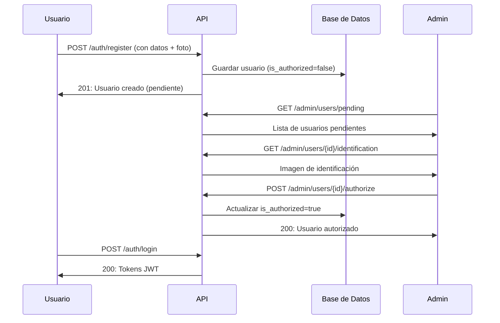
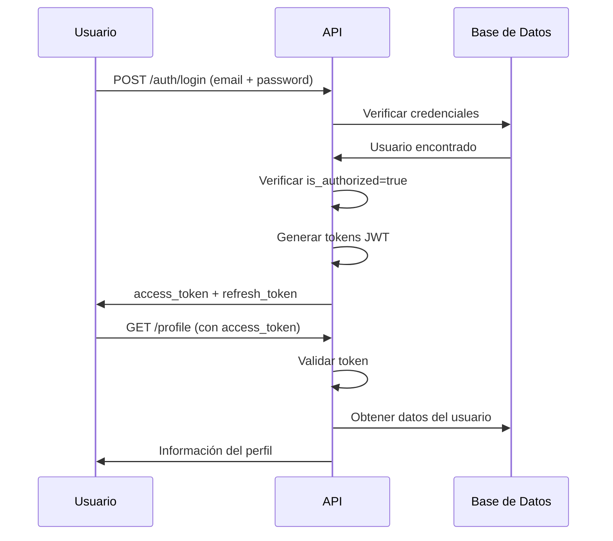

# API Login - Sistema de Autenticación con Roles y Autorización

Sistema completo de autenticación REST API construido con Flask que proporciona registro de usuarios, sistema de autorización, múltiples roles y autenticación basada en JWT. Los usuarios deben ser autorizados por un administrador antes de poder acceder al sistema.

## Características

- ✅ Registro de usuarios con validación completa de datos personales
- ✅ Sistema de autorización administrativa para nuevos usuarios
- ✅ 8 roles de usuario diferentes con permisos específicos
- ✅ Autenticación JWT con tokens de acceso y refresh
- ✅ **Almacenamiento de imágenes en Google Drive o local**
- ✅ Gestión de fotografías de identificación oficial
- ✅ Validación de email, teléfono y datos personales
- ✅ Panel administrativo para aprobar/rechazar usuarios
- ✅ Base de datos PostgreSQL/SQLite con SQLAlchemy ORM
- ✅ Seguridad con hash de contraseñas
- ✅ Endpoints protegidos por roles
- ✅ **Migración automática de archivos locales a Google Drive**

## Stack Tecnológico

- **Framework**: FastAPI 0.119.0
- **Base de Datos**: PostgreSQL/SQLite con SQLAlchemy ORM
- **Autenticación**: JWT tokens usando python-jose
- **Hash de Contraseñas**: bcrypt
- **Validación de Email**: email-validator library
- **Manejo de Archivos**: Werkzeug file utilities + **Google Drive API**
- **Variables de Entorno**: python-dotenv
- **Almacenamiento en la Nube**: Google Drive API v3

## Roles del Sistema

| Rol              | Descripción                                | Autorización Requerida |
| ---------------- | ------------------------------------------ | ---------------------- |
| `admin`          | Administrador con acceso completo          | No (creado manualmente)|
| `voluntarios`    | Voluntarios de la organización             | Sí                     |
| `personal`       | Personal de la organización                | Sí                     |
| `servicio_social`| Personas realizando servicio social        | Sí                     |
| `visitas`        | Visitantes autorizados                     | Sí                     |
| `familiares`     | Familiares de beneficiarios                | Sí                     |
| `donantes`       | Donantes de la organización                | Sí                     |
| `proveedores`    | Proveedores de servicios o productos       | Sí                     |

## Installation

1. Clone the repository:

```bash
git clone <repository-url>
cd api-login
```

2. Create a virtual environment:

```bash
python -m venv venv
source venv/bin/activate  # On Windows: venv\Scripts\activate
```

3. Install dependencies:

```bash
pip install -r requirements.txt
```

4. Create a `.env` file in the root directory:

```env
DATABASE_URL=sqlite:///./api_login.db
JWT_SECRET_KEY=tu-clave-super-secreta-aqui-cambiala-en-produccion
ACCESS_TOKEN_EXPIRES=15
REFRESH_TOKEN_EXPIRES_DAYS=7
UPLOAD_FOLDER=data/identificaciones
MAX_FILE_SIZE=5242880

# Google Drive Configuration (Optional)
GOOGLE_DRIVE_ENABLED=true
GOOGLE_CREDENTIALS_PATH=credentials.json
GOOGLE_TOKEN_PATH=token.json
GOOGLE_SERVICE_ACCOUNT_PATH=service-account-key.json
GOOGLE_DRIVE_FOLDER_ID=your_drive_folder_id
```

5. Create dir:
```bash
mkdir -p data/identificaciones
mkdir -p instance
```

6. (Optional) Configure Google Drive:

Si quieres almacenar las imágenes en Google Drive en lugar de localmente, sigue la guía completa en [`docs/GOOGLE_DRIVE_SETUP.md`](docs/GOOGLE_DRIVE_SETUP.md).

7. Run the database migration:

```bash
python utils/migrate_drive_field.py
```

8. Run the application:

```bash
python main.py
# or with uvicorn
uvicorn main:app --reload --host 0.0.0.0 --port 8000
```

The API will be available at `http://localhost:8000`

## 📁 Almacenamiento de Imágenes

Este sistema soporta dos métodos de almacenamiento para las imágenes de identificación:

### 🏠 Almacenamiento Local (Por defecto)
- Las imágenes se guardan en la carpeta `data/identificaciones/`
- Funciona sin configuración adicional
- Ideal para desarrollo y pequeñas instalaciones

### ☁️ Almacenamiento en Google Drive (Recomendado)
- Las imágenes se almacenan en Google Drive
- Mayor seguridad y respaldo automático
- Escalable para grandes volúmenes
- **Guía completa**: [`docs/GOOGLE_DRIVE_SETUP.md`](docs/GOOGLE_DRIVE_SETUP.md)

Para cambiar entre métodos, modifica la variable `GOOGLE_DRIVE_ENABLED` en tu archivo `.env`.

## Environment Variables

| Variable                     | Description                             | Default Value       |
| ---------------------------- | --------------------------------------- | ------------------- |
| `DATABASE_URL`               | Database connection string              | `sqlite:///./api_login.db` |
| `JWT_SECRET_KEY`             | Secret key for JWT token signing        | `super-secret`      |
| `ACCESS_TOKEN_EXPIRES`       | Access token expiration time in minutes | `15`                |
| `REFRESH_TOKEN_EXPIRES_DAYS` | Refresh token expiration time in days   | `7`                 |
| `UPLOAD_FOLDER`              | Carpeta para almacenar identificaciones | `data/identificaciones`|
| `MAX_FILE_SIZE`              | Tamaño máximo de archivo (bytes)        | `5242880` (5MB)     |
| **Google Drive Variables**   |                                         |                     |
| `GOOGLE_DRIVE_ENABLED`       | Habilitar almacenamiento en Google Drive| `false`             |
| `GOOGLE_CREDENTIALS_PATH`    | Ruta a credentials.json (OAuth)         | `credentials.json`  |
| `GOOGLE_TOKEN_PATH`          | Ruta a token.json (OAuth)               | `token.json`        |
| `GOOGLE_SERVICE_ACCOUNT_PATH`| Ruta a service account key (Producción) | `null`              |
| `GOOGLE_DRIVE_FOLDER_ID`     | ID de carpeta específica en Drive       | `null` (raíz)       |

## API Endpoints

### Endpoints Públicos

#### Verificar Estado del Servidor
```http
GET /health
```
**Response (200 OK):**
```
{
  "status": "ok",
  "time": "2025-10-09T10:30:00.123456"
}
```

#### Register User

```http
POST /auth/register
Content-Type: multipart/form-data
```
**Parámetros del formulario:**
| Campo               | Tipo    | Requerido   | Descripción                     |
| --------------------|---------|-------------|---------------------------------|
| email               | string  | Sí          | Email válido y único            |
| password            | string  | Sí          | Contraseña (mínimo 6 caracteres)|
| nombre_completo     | string  | Sí          | Nombre(s) del usuario           |
| apellidos           | string  | Sí          | Apellidos del usuario           |
| direccion           | string  | Sí          | Dirección completa              |
| edad                | integer | Sí          | Edad (18+)                      |
| telefono            | string  | Sí          | Teléfono (10 dígitos)           |
| foto_identificacion | file    | Sí          | Imagen JPG/PNG (máx 5MB)        |
| role                | string  | Sí          | Rol solicitado                  |

**Response (201 Created):**

```json
{
  "message": "Usuario registrado exitosamente. Pendiente de autorización por un administrador.",
  "user": {
    "id": 5,
    "email": "juan.perez@example.com",
    "nombre_completo": "Juan",
    "apellidos": "Pérez García",
    "direccion": "Calle Principal #123",
    "edad": 28,
    "telefono": "+525512345678",
    "role": "voluntarios",
    "is_authorized": false,
    "foto_identificacion_path": "/data/identificaciones/user_5_id.jpg",
    "created_at": "2025-10-09T10:30:00.123456",
    "authorized_at": null
  }
}
```

#### Login User

```http
POST /auth/login
Content-Type: application/json

{
    "email": "john@example.com",
    "password": "securepassword123"
}
```

**Response (200 OK):**

```json
{
  "message": "Login exitoso.",
  "access_token": "eyJ0eXAiOiJKV1QiLCJhbGciOiJIUzI1NiJ9...",
  "refresh_token": "eyJ0eXAiOiJKV1QiLCJhbGciOiJIUzI1NiJ9..."
}
```

#### Refresh Token

```http
POST /auth/refresh
Authorization: Bearer <refresh_token>
```

**Response (200 OK):**

```json
{
  "access_token": "eyJ0eXAiOiJKV1QiLCJhbGciOiJIUzI1NiJ9..."
}
```

### Protected Endpoints

#### Get User Profile

```http
GET /profile
Authorization: Bearer <access_token>
```

**Response (200 OK):**

```json
{
  "user": {
    "id": 5,
    "email": "juan.perez@example.com",
    "nombre_completo": "Juan",
    "apellidos": "Pérez García",
    "direccion": "Calle Principal #123",
    "edad": 28,
    "telefono": "+525512345678",
    "role": "voluntarios",
    "is_authorized": true,
    "created_at": "2025-10-09T10:30:00.123456",
    "authorized_at": "2025-10-09T14:20:00.123456"
  }
}
```

**Response Error (403 Forbidden) - Usuario no autorizado:**

```json
{
  "error": "Tu cuenta está pendiente de autorización. Por favor espera a que un administrador apruebe tu registro."
}
```

## Endpoints Administrativos (Solo Admin)

### Listar Usuarios Pendientes
```http
GET /admin/users/pending?page=1&per_page=20&role=voluntarios
Authorization: Bearer <access_token>
```
**Parámetros de consulta:**
| Parámetro   | Tipo    | Descripción                 | Por Defecto |
|-------------|---------|-----------------------------|-------------|
| page        | integer | Número de página            | 1           |
| per_page    | integer | Usuarios por página (1-100) | 20          |
| role        | string  | Filtrar por rol específico  | todos       |

**Response (200 OK):**

```json
{
  "users": [
    {
      "id": 5,
      "email": "juan.perez@example.com",
      "nombre_completo": "Juan",
      "apellidos": "Pérez García",
      "direccion": "Calle Principal #123",
      "edad": 28,
      "telefono": "+525512345678",
      "role": "voluntarios",
      "is_authorized": false,
      "foto_identificacion_path": "/data/identificaciones/user_5_id.jpg",
      "created_at": "2025-10-09T10:30:00.123456",
      "authorized_at": null
    }
  ],
  "total": 15,
  "page": 1,
  "per_page": 20,
  "total_pages": 1
}
```

### Autorizar Usuario
```http
POST /admin/users/5/authorize
Authorization: Bearer <access_token>
```

**Response (200 OK):**

```json
{
  "message": "Usuario autorizado exitosamente.",
  "user": {
    "id": 5,
    "email": "juan.perez@example.com",
    "nombre_completo": "Juan",
    "apellidos": "Pérez García",
    "role": "voluntarios",
    "is_authorized": true,
    "authorized_at": "2025-10-09T14:20:00.123456"
  }
}
```

### Deny User
```http
POST /admin/users/5/reject
Authorization: Bearer <access_token>
Content-Type: application/json
```
**Response (200 OK):**

```json
{
  "message": "Usuario rechazado y eliminado exitosamente."
}
```

### Ver Identificación de Usuario
```http
GET /admin/users/5/identification
Authorization: Bearer <access_token>
```
**Response (200 OK):**
Devuelve la imagen directamente (image/jpeg o image/png)

## 📷 Endpoints de Gestión de Imágenes

### Descargar Imagen de Identificación
```http
GET /images/identification/{user_id}
Authorization: Bearer <access_token>
```
**Permisos**: Administradores o el propio usuario

**Response (200 OK):**
Devuelve la imagen directamente desde Google Drive o almacenamiento local

### Obtener Información de Imagen
```http
GET /images/identification/{user_id}/info
Authorization: Bearer <access_token>
```
**Permisos**: Administradores o el propio usuario

**Response (200 OK):**
```json
{
  "user_id": 5,
  "has_identification": true,
  "drive_id": "1ABC123def456GHI789jkl",
  "legacy_path": "drive://1ABC123def456GHI789jkl",
  "drive_url": "https://drive.google.com/file/d/1ABC123def456GHI789jkl/view"
}
```

### Eliminar Imagen de Identificación
```http
DELETE /images/identification/{user_id}
Authorization: Bearer <access_token>
```
**Permisos**: Solo administradores

**Response (200 OK):**
```json
{
  "message": "Imagen de identificación del usuario 5 eliminada exitosamente.",
  "drive_response": "Archivo eliminado correctamente"
}
```

### Estadísticas sistema
```http
GET /admin/stats
Authorization: Bearer <access_token>
```
**Response (200 OK):**

```json
{
  "users_total": 150,
  "users_authorized": 120,
  "users_pending": 30,
  "users_by_role": {
    "admin": 5,
    "voluntarios": 40,
    "personal": 25,
    "servicio_social": 15,
    "visitas": 20,
    "familiares": 30,
    "donantes": 10,
    "proveedores": 5
  }
}
```

## Error Responses

The API returns consistent error responses in the following format:

```json
{
  "error": "Error message description"
}
```

### Common Error Codes

- `400 Bad Request`: Missing required fields, invalid email format, password too short
- `401 Unauthorized`: Invalid credentials, expired or invalid token
- `403 Forbidden`: suario no autorizado o permisos insuficientes
- `404 Not Found`: User not found
- `409 Conflict`: Email already registered

## Validation Rules

### Registro de Usuario
|Campo               | Validación                               |
|--------------------| -----------------------------------------|
|email               | Formato válido, único en la base de datos|
|password            | Mínimo 6 caracteres                      |
|nombre_completo     | 1-100 caracteres, no vacío               |
|apellidos           | 1-100 caracteres, no vacío               |
|direccion           | 1-255 caracteres, no vacío               |
|edad                | Entero entre 18 y 120                    |
|telefono            | 10 dígitos, puede incluir +              |
|foto_identificacion | JPG/PNG, máximo 5MB                      |
|role                | Debe ser uno de los 8 roles válidos      |


### Email Validation

- Emails are normalized (lowercased, trimmed)
- Email format validation using the `email-validator` library
- Deliverability checking is disabled for performance

## Security Features

- Passwords are hashed using Werkzeug's secure password hashing
- JWT tokens with configurable expiration times
- Separate access and refresh tokens
- Email normalization to prevent duplicate accounts
- No sensitive information exposed in error messages
- CORS protection (can be configured as needed)

## Workflow
### Register and Auth


### Auth


## Database Schema

### Users Table

```sql
CREATE TABLE users (
    id INTEGER PRIMARY KEY AUTOINCREMENT,
    email VARCHAR(120) UNIQUE NOT NULL,
    password_hash VARCHAR(255) NOT NULL,
    nombre_completo VARCHAR(100) NOT NULL,
    apellidos VARCHAR(100) NOT NULL,
    direccion VARCHAR(255) NOT NULL,
    edad INTEGER NOT NULL,
    telefono VARCHAR(20) NOT NULL,
    role VARCHAR(20) NOT NULL DEFAULT 'voluntarios',
    is_authorized BOOLEAN NOT NULL DEFAULT FALSE,
    foto_identificacion_path VARCHAR(255),
    created_at DATETIME NOT NULL DEFAULT CURRENT_TIMESTAMP,
    authorized_at DATETIME,
    authorized_by_id INTEGER,
    FOREIGN KEY (authorized_by_id) REFERENCES users (id),
    CHECK (edad >= 18),
    CHECK (role IN ('admin', 'voluntarios', 'personal', 'servicio_social', 
                    'visitas', 'familiares', 'donantes', 'proveedores'))
);
```

### Recomended index
```sql
CREATE INDEX idx_users_email ON users(email);
CREATE INDEX idx_users_role ON users(role);
CREATE INDEX idx_users_is_authorized ON users(is_authorized);
CREATE INDEX idx_users_created_at ON users(created_at);
```

## Development

### Project Structure

```
api-login/
├── main.py                     # Aplicación principal FastAPI
├── config.py                   # Configuración y variables de entorno
├── database.py                 # Configuración de base de datos
├── models.py                   # Modelos de SQLAlchemy
├── schemas.py                  # Esquemas de Pydantic
├── requirements.txt            # Dependencias Python
├── .env                        # Variables de entorno (no incluir en git)
├── .env.example                # Ejemplo de variables de entorno
├── .gitignore                  # Archivos a ignorar en git
├── README.md                   # Este archivo
├── routes/
│   ├── __init__.py
│   ├── auth.py                 # Endpoints de autenticación
│   ├── user.py                 # Endpoints de usuario
│   ├── admin.py                # Endpoints administrativos
│   └── images.py               # Gestión de imágenes (nuevo)
├── utils/
│   ├── __init__.py
│   ├── auth.py                 # Utilidades de autenticación
│   ├── google_drive.py         # Integración con Google Drive (nuevo)
│   ├── migrate_drive_field.py  # Migración de BD para Google Drive (nuevo)
│   ├── migrate_to_drive.py     # Migración de archivos a Google Drive (nuevo)
│   └── test_google_drive.py    # Tests de Google Drive (nuevo)
├── docs/
│   └── GOOGLE_DRIVE_SETUP.md   # Guía de configuración de Google Drive (nuevo)
├── data/
│   └── identificaciones/       # Fotografías locales (compatibilidad)
│       ├── user_1_id.jpg
│       ├── user_2_id.png
│       └── ...
├── credentials.json            # Credenciales OAuth Google (no incluir en git)
├── token.json                  # Token OAuth Google (generado automáticamente)
├── service-account-key.json    # Service Account Google (no incluir en git)
└── __pycache__/                # Cache de Python
```

### Running in Development Mode

The application runs in debug mode by default when started with `python app.py`. This enables:

- Automatic reloading on code changes
- Detailed error messages
- Debug toolbar (if configured)

### Database Management

The database is automatically created when the application starts. Para gestionar cambios en la estructura:

```bash
# Migrar base de datos para Google Drive
python utils/migrate_drive_field.py

# Verificar estado de migración de archivos
python utils/migrate_to_drive.py verify

# Migrar archivos locales existentes a Google Drive
python utils/migrate_to_drive.py

# Probar configuración de Google Drive
python utils/test_google_drive.py
```

### Google Drive Management

```bash
# Test Google Drive connection
python utils/test_google_drive.py

# Migrate existing local files to Google Drive  
python utils/migrate_to_drive.py

# Check migration status
python utils/migrate_to_drive.py verify
```

## Production Considerations

1. **Security**:

   - Change the `JWT_SECRET_KEY` to a strong, randomly generated secret
   - Use a production database (PostgreSQL, MySQL)
   - Enable HTTPS
   - Configure proper CORS settings

2. **Performance**:

   - Use a production WSGI server (Gunicorn, uWSGI)
   - Configure database connection pooling
   - Implement rate limiting
   - Add caching where appropriate

3. **Monitoring**:
   - Add logging
   - Implement health check endpoints
   - Monitor token usage and security events

## License

This project is licensed under the MIT License - see the LICENSE file for details.

