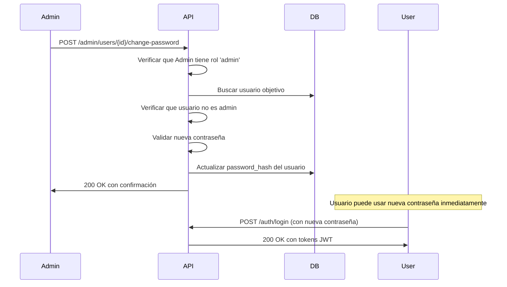

# 🔑 Endpoint: Cambiar Contraseña de Usuario (Admin)

## Descripción

Endpoint administrativo que permite a un administrador cambiar la contraseña de cualquier usuario que **no sea otro administrador**.

## Endpoint

```http
POST /admin/users/{user_id}/change-password
```

## Autenticación

- ✅ Requiere autenticación JWT (Bearer token)
- ✅ Requiere rol de **administrador**
- ✅ Rate limit: **10 solicitudes por minuto**

## Parámetros

### Path Parameters

| Parámetro | Tipo | Requerido | Descripción |
|-----------|------|-----------|-------------|
| `user_id` | integer | Sí | ID del usuario al que se le cambiará la contraseña |

### Request Body (JSON)

```json
{
  "new_password": "NuevaContraseña123!"
}
```

| Campo | Tipo | Requerido | Validación | Descripción |
|-------|------|-----------|------------|-------------|
| `new_password` | string | Sí | 6-100 caracteres, requisitos de seguridad | La nueva contraseña para el usuario |

### Requisitos de la Contraseña

La contraseña debe cumplir con los siguientes requisitos de seguridad:
- ✅ Mínimo 8 caracteres (recomendado)
- ✅ Al menos una letra mayúscula
- ✅ Al menos una letra minúscula
- ✅ Al menos un número
- ✅ Al menos un carácter especial
- ✅ No ser una contraseña común
- ✅ No contener información personal obvia

## Restricciones

1. **Solo administradores**: Solo usuarios con rol `admin` pueden usar este endpoint
2. **No cambiar contraseñas de admins**: No se puede cambiar la contraseña de otro usuario con rol `admin`
3. **Validación de seguridad**: La contraseña debe pasar todas las validaciones del `PasswordValidator`

## Respuestas

### 200 OK - Éxito

```json
{
  "message": "Contraseña actualizada exitosamente para el usuario Juan Pérez",
  "user_id": 5,
  "user_email": "juan.perez@example.com",
  "changed_by": "Admin Usuario",
  "changed_at": "2026-01-04T15:30:45.123456"
}
```

### 400 Bad Request - Contraseña inválida

```json
{
  "detail": "La nueva contraseña no cumple con los requisitos de seguridad:\n• La contraseña debe tener al menos 8 caracteres\n• Debe contener al menos una letra mayúscula\n\nSugerencias:\n• Usa una combinación de letras, números y símbolos"
}
```

### 403 Forbidden - Intento de cambiar contraseña de admin

```json
{
  "detail": "No se puede cambiar la contraseña de otro administrador."
}
```

### 404 Not Found - Usuario no encontrado

```json
{
  "detail": "Usuario no encontrado."
}
```

### 401 Unauthorized - Sin autenticación

```json
{
  "detail": "Could not validate credentials"
}
```

### 429 Too Many Requests - Rate limit excedido

```json
{
  "detail": "Rate limit exceeded: 10 per 1 minute"
}
```

## Ejemplos de Uso

### Ejemplo con cURL

```bash
# 1. Primero, hacer login como admin
curl -X POST "http://localhost:8000/auth/login" \
  -H "Content-Type: application/json" \
  -d '{
    "email": "admin@example.com",
    "password": "admin123"
  }'

# Respuesta: { "access_token": "eyJ0eXAiOiJKV1...", ... }

# 2. Cambiar contraseña del usuario con ID 5
curl -X POST "http://localhost:8000/admin/users/5/change-password" \
  -H "Authorization: Bearer eyJ0eXAiOiJKV1..." \
  -H "Content-Type: application/json" \
  -d '{
    "new_password": "NuevaContraseña123!"
  }'
```

### Ejemplo con Python (requests)

```python
import requests

# 1. Login como admin
login_response = requests.post(
    "http://localhost:8000/auth/login",
    json={
        "email": "admin@example.com",
        "password": "admin123"
    }
)
access_token = login_response.json()["access_token"]

# 2. Cambiar contraseña
headers = {
    "Authorization": f"Bearer {access_token}",
    "Content-Type": "application/json"
}

response = requests.post(
    "http://localhost:8000/admin/users/5/change-password",
    json={"new_password": "NuevaContraseña123!"},
    headers=headers
)

print(response.json())
```

### Ejemplo con JavaScript (fetch)

```javascript
// 1. Login como admin
const loginResponse = await fetch('http://localhost:8000/auth/login', {
  method: 'POST',
  headers: { 'Content-Type': 'application/json' },
  body: JSON.stringify({
    email: 'admin@example.com',
    password: 'admin123'
  })
});
const { access_token } = await loginResponse.json();

// 2. Cambiar contraseña
const response = await fetch('http://localhost:8000/admin/users/5/change-password', {
  method: 'POST',
  headers: {
    'Authorization': `Bearer ${access_token}`,
    'Content-Type': 'application/json'
  },
  body: JSON.stringify({
    new_password: 'NuevaContraseña123!'
  })
});

const result = await response.json();
console.log(result);
```

## Casos de Uso

### 1. Usuario olvidó su contraseña

Un usuario contacta al administrador porque olvidó su contraseña:

1. El administrador verifica la identidad del usuario
2. El administrador genera una nueva contraseña temporal
3. El administrador usa este endpoint para cambiar la contraseña
4. El administrador comunica la contraseña temporal al usuario de forma segura
5. El usuario debe cambiar su contraseña al iniciar sesión (implementar en futuro)

### 2. Cuenta comprometida

Se detecta actividad sospechosa en una cuenta:

1. El administrador desautoriza al usuario temporalmente
2. El administrador cambia la contraseña usando este endpoint
3. El administrador contacta al usuario legítimo
4. Se verifica la identidad y se proporciona la nueva contraseña
5. Se re-autoriza al usuario

### 3. Reseteo masivo de contraseñas

En caso de una brecha de seguridad:

1. Script automatizado que itera sobre usuarios afectados
2. Genera contraseñas seguras aleatorias
3. Usa este endpoint para actualizar cada cuenta
4. Envía notificaciones a los usuarios afectados

## Seguridad

### Buenas Prácticas Implementadas

- ✅ **Autenticación obligatoria**: Solo usuarios autenticados pueden acceder
- ✅ **Autorización por rol**: Solo administradores tienen acceso
- ✅ **Protección de admins**: No se puede cambiar contraseñas de otros admins
- ✅ **Validación de contraseñas**: Requisitos de seguridad estrictos
- ✅ **Rate limiting**: Previene ataques de fuerza bruta
- ✅ **Logging implícito**: FastAPI registra todas las solicitudes
- ✅ **Hashing seguro**: Usa bcrypt con salt para almacenar contraseñas

### Recomendaciones Adicionales

1. **Auditoría**: Considera implementar un log de auditoría específico para cambios de contraseña
2. **Notificación**: Implementa notificaciones por email al usuario cuando su contraseña es cambiada
3. **Contraseñas temporales**: Considera marcar contraseñas cambiadas por admin como "temporales" y forzar cambio en el próximo login
4. **Historial**: Prevenir reutilización de contraseñas anteriores
5. **Expiración**: Implementar expiración de contraseñas después de cierto tiempo

## Pruebas

Ejecuta el script de prueba incluido:

```bash
python test_admin_change_password.py
```

Asegúrate de ajustar las variables de configuración en el script:
- `BASE_URL`: URL de tu API
- `ADMIN_EMAIL`: Email de un usuario admin
- `ADMIN_PASSWORD`: Contraseña del admin
- `TARGET_USER_ID`: ID del usuario de prueba
- `NEW_PASSWORD`: Nueva contraseña para el test

## Notas Importantes

- ⚠️ Este endpoint es muy poderoso - solo otorgar rol de admin a usuarios de confianza
- 📝 Considera implementar un sistema de auditoría para rastrear cambios de contraseña
- 🔔 Implementa notificaciones al usuario cuando su contraseña es cambiada
- 🔐 Las contraseñas se almacenan usando bcrypt con salt (seguro)
- ⏱️ El cambio de contraseña es inmediato - el usuario puede usarla de inmediato

## Integración con el Sistema

### Endpoints Relacionados

- `POST /auth/login` - Login con la nueva contraseña
- `POST /admin/users/{user_id}/unauthorize` - Desautorizar usuario si es necesario
- `POST /admin/users/{user_id}/reauthorize` - Re-autorizar usuario después del cambio

### Flujo Típico



## Changelog

### v1.0.0 (2026-01-04)
- ✨ Implementación inicial del endpoint
- ✅ Validación con PasswordValidator
- ✅ Restricciones para proteger cuentas de admin
- ✅ Rate limiting de 10 req/min
- ✅ Documentación completa

---

**Documentación generada**: 2026-01-04  
**Versión API**: 1.0  
**Endpoint**: `/admin/users/{user_id}/change-password`
