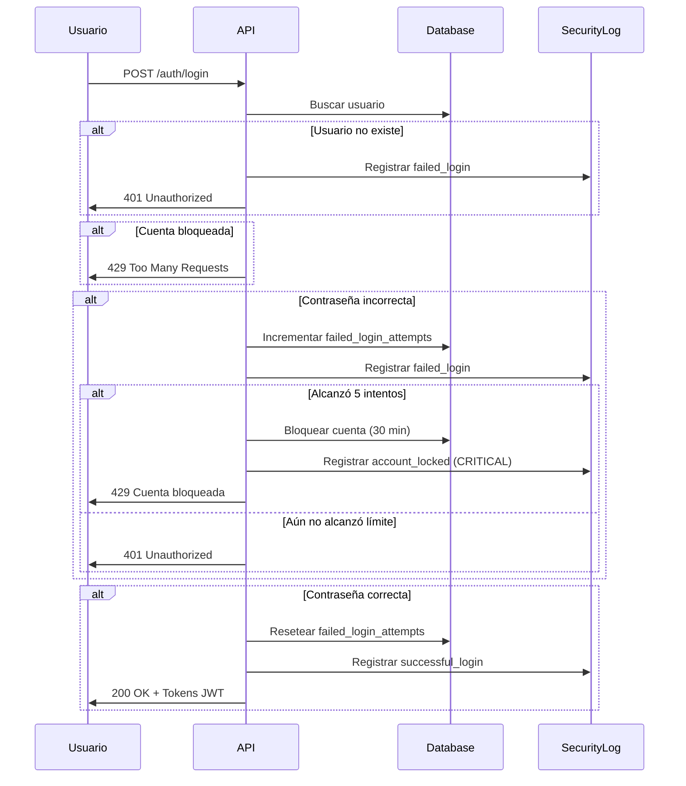

# 🛡️ Sistema de Logs de Seguridad

## Descripción General

Sistema completo de auditoría y seguridad que registra eventos críticos del sistema, detecta intentos de acceso sospechosos, y protege cuentas contra ataques de fuerza bruta.

## 🎯 Características Principales

### 1. Detección de Intentos Fallidos
- ✅ Registra cada intento fallido de login
- ✅ Bloqueo automático después de 5 intentos fallidos
- ✅ Bloqueo temporal de 30 minutos
- ✅ Reseteo automático después de login exitoso
- ✅ Alertas críticas para administradores

### 2. Registro de Eventos de Seguridad
- ✅ Cambios de contraseña (por usuario o admin)
- ✅ Autorizaciones y desautorizaciones de usuarios
- ✅ Reactivaciones de cuentas
- ✅ Bloqueos y desbloqueos de cuentas
- ✅ Actividad sospechosa

### 3. Trazabilidad Completa
- ✅ IP del cliente en cada evento
- ✅ User-Agent para identificar dispositivos
- ✅ Timestamp preciso de cada evento
- ✅ Metadata adicional en formato JSON
- ✅ Niveles de severidad (info, warning, critical)

## 📊 Modelo de Datos

### Tabla: `security_logs`

| Campo | Tipo | Descripción |
|-------|------|-------------|
| id | Integer | ID único del log |
| event_type | Enum | Tipo de evento (ver tipos abajo) |
| user_id | Integer | Usuario afectado (nullable) |
| performed_by_id | Integer | Usuario que realizó la acción (nullable) |
| ip_address | String(45) | IP del cliente (IPv4 o IPv6) |
| user_agent | String(500) | Información del navegador/cliente |
| description | Text | Descripción detallada del evento |
| metadata | Text | JSON con información adicional |
| severity | String(20) | Nivel: info, warning, critical |
| timestamp | DateTime | Fecha y hora del evento |

### Nuevos Campos en `users`

| Campo | Tipo | Descripción |
|-------|------|-------------|
| failed_login_attempts | Integer | Contador de intentos fallidos |
| last_failed_login | DateTime | Última vez que falló el login |
| account_locked_until | DateTime | Fecha hasta la que está bloqueada |

### Tipos de Eventos (SecurityEventType)

```python
FAILED_LOGIN = "failed_login"                    # Intento fallido
SUCCESSFUL_LOGIN = "successful_login"            # Login exitoso
PASSWORD_CHANGED = "password_changed"            # Usuario cambió su contraseña
PASSWORD_CHANGED_BY_ADMIN = "password_changed_by_admin"  # Admin cambió contraseña
USER_AUTHORIZED = "user_authorized"              # Usuario autorizado
USER_UNAUTHORIZED = "user_unauthorized"          # Usuario suspendido
USER_REAUTHORIZED = "user_reauthorized"          # Usuario reactivado
ACCOUNT_LOCKED = "account_locked"                # Cuenta bloqueada
ACCOUNT_UNLOCKED = "account_unlocked"            # Cuenta desbloqueada
SUSPICIOUS_ACTIVITY = "suspicious_activity"      # Actividad sospechosa
```

## 🔌 API Endpoints

### 1. Obtener Logs de Seguridad

```http
GET /admin/security-logs
Authorization: Bearer <admin_token>
```

**Parámetros de consulta**:
- `user_id` (opcional): Filtrar por usuario específico
- `event_type` (opcional): Tipo de evento (failed_login, password_changed, etc.)
- `severity` (opcional): Nivel de severidad (info, warning, critical)
- `limit` (opcional): Número de resultados (default: 100, max: 500)
- `offset` (opcional): Offset para paginación (default: 0)

**Ejemplo**:
```bash
curl -X GET "http://localhost:8000/admin/security-logs?severity=critical&limit=50" \
  -H "Authorization: Bearer TOKEN"
```

**Respuesta**:
```json
{
  "logs": [
    {
      "id": 123,
      "event_type": "account_locked",
      "user_id": 5,
      "user_email": "juan@example.com",
      "user_name": "Juan Pérez",
      "performed_by_id": null,
      "ip_address": "192.168.1.100",
      "user_agent": "Mozilla/5.0...",
      "description": "Cuenta bloqueada temporalmente por 5 intentos fallidos",
      "metadata": "{\"failed_attempts\": 5}",
      "severity": "critical",
      "timestamp": "2026-01-04T15:30:00"
    }
  ],
  "total": 150,
  "limit": 50,
  "offset": 0
}
```

### 2. Usuarios con Intentos Fallidos

```http
GET /admin/security-logs/failed-logins
Authorization: Bearer <admin_token>
```

**Parámetros**:
- `min_attempts` (opcional): Mínimo de intentos fallidos (default: 3)

**Ejemplo**:
```bash
curl -X GET "http://localhost:8000/admin/security-logs/failed-logins?min_attempts=3" \
  -H "Authorization: Bearer TOKEN"
```

**Respuesta**:
```json
[
  {
    "user_id": 5,
    "email": "juan@example.com",
    "nombre_completo": "Juan Pérez García",
    "failed_attempts": 4,
    "last_failed_login": "2026-01-04T15:25:00",
    "account_locked": false,
    "locked_until": null
  },
  {
    "user_id": 8,
    "email": "maria@example.com",
    "nombre_completo": "María López Torres",
    "failed_attempts": 5,
    "last_failed_login": "2026-01-04T15:30:00",
    "account_locked": true,
    "locked_until": "2026-01-04T16:00:00"
  }
]
```

### 3. Desbloquear Cuenta

```http
POST /admin/security-logs/unlock-account/{user_id}
Authorization: Bearer <admin_token>
```

**Ejemplo**:
```bash
curl -X POST "http://localhost:8000/admin/security-logs/unlock-account/5" \
  -H "Authorization: Bearer TOKEN"
```

**Respuesta**:
```json
{
  "message": "Cuenta desbloqueada exitosamente para juan@example.com",
  "user_id": 5,
  "user_email": "juan@example.com",
  "unlocked_by": "Admin Usuario"
}
```

## 🔐 Flujo de Seguridad en Login



## 🚀 Instalación y Migración

### 1. Ejecutar Migración

```bash
python migrate_security_features.py
```

Este script:
- ✅ Agrega las columnas de seguridad a la tabla `users`
- ✅ Crea la tabla `security_logs`
- ✅ Mantiene los datos existentes intactos

### 2. Verificar Migración

El script mostrará un resumen al finalizar:
```
✅ MIGRACIÓN COMPLETADA EXITOSAMENTE
📝 Cambios aplicados:
  ✅ Columnas de seguridad agregadas a tabla users
  ✅ Tabla security_logs creada/verificada
🚀 El sistema está listo para usar las nuevas funcionalidades de seguridad
```

## 📝 Uso Programático

### Registrar Evento de Seguridad

```python
from utils.security_logger import log_security_event
from models import SecurityEventType

log_security_event(
    db=db,
    event_type=SecurityEventType.SUSPICIOUS_ACTIVITY,
    description="Actividad sospechosa detectada",
    user_id=user.id,
    ip_address="192.168.1.100",
    user_agent="Mozilla/5.0...",
    metadata={"reason": "Múltiples IPs en corto tiempo"},
    severity="critical"
)
```

### Verificar Intentos Fallidos

```python
from utils.security_logger import check_failed_login_attempts

is_locked = check_failed_login_attempts(
    db=db,
    request=request,
    user=user,
    max_attempts=5,
    lockout_duration_minutes=30
)

if is_locked:
    # Cuenta bloqueada
    raise HTTPException(status_code=429, detail="Cuenta bloqueada")
```

### Consultar Logs

```python
from utils.security_logger import get_security_logs
from models import SecurityEventType

result = get_security_logs(
    db=db,
    user_id=5,
    event_type=SecurityEventType.FAILED_LOGIN,
    severity="warning",
    limit=50
)

for log in result['logs']:
    print(f"{log['timestamp']}: {log['description']}")
```

## 🎨 Casos de Uso

### 1. Detectar Ataque de Fuerza Bruta

```bash
# Ver todos los intentos fallidos en las últimas horas
curl -X GET "http://localhost:8000/admin/security-logs?event_type=failed_login&severity=warning&limit=100" \
  -H "Authorization: Bearer TOKEN"
```

### 2. Auditar Cambios de Contraseña

```bash
# Ver todos los cambios de contraseña
curl -X GET "http://localhost:8000/admin/security-logs?event_type=password_changed_by_admin" \
  -H "Authorization: Bearer TOKEN"
```

### 3. Monitorear Suspensiones

```bash
# Ver usuarios desautorizados
curl -X GET "http://localhost:8000/admin/security-logs?event_type=user_unauthorized" \
  -H "Authorization: Bearer TOKEN"
```

### 4. Identificar Cuentas Comprometidas

```bash
# Ver usuarios con muchos intentos fallidos
curl -X GET "http://localhost:8000/admin/security-logs/failed-logins?min_attempts=3" \
  -H "Authorization: Bearer TOKEN"
```

## ⚙️ Configuración

### Personalizar Límites

En `routes/auth.py`, puedes modificar:

```python
# Máximo de intentos antes de bloquear
max_attempts = 5  # default

# Duración del bloqueo en minutos
lockout_duration_minutes = 30  # default
```

### Niveles de Severidad

- **info**: Eventos normales (login exitoso, cambios propios)
- **warning**: Eventos que requieren atención (intentos fallidos, cambios por admin)
- **critical**: Eventos críticos (cuentas bloqueadas, múltiples intentos fallidos)

## 📊 Dashboard de Seguridad (Ejemplo)

Puedes crear un dashboard que muestre:

1. **Intentos Fallidos en Tiempo Real**
   ```bash
   GET /admin/security-logs/failed-logins
   ```

2. **Eventos Críticos Recientes**
   ```bash
   GET /admin/security-logs?severity=critical&limit=10
   ```

3. **Actividad por Usuario**
   ```bash
   GET /admin/security-logs?user_id=5&limit=20
   ```

## 🔍 Troubleshooting

### Cuenta bloqueada permanentemente

Si una cuenta queda bloqueada indefinidamente:

```bash
# Desbloquear manualmente
curl -X POST "http://localhost:8000/admin/security-logs/unlock-account/USER_ID" \
  -H "Authorization: Bearer ADMIN_TOKEN"
```

### Ver logs de un usuario específico

```bash
curl -X GET "http://localhost:8000/admin/security-logs?user_id=5&limit=50" \
  -H "Authorization: Bearer TOKEN"
```

### Limpiar intentos fallidos

El contador se resetea automáticamente después de un login exitoso, pero un admin puede desbloquear manualmente la cuenta.

## 🎓 Mejores Prácticas

1. **Monitoreo Regular**: Revisa los logs críticos diariamente
2. **Alertas Automáticas**: Configura notificaciones para eventos críticos
3. **Retención de Logs**: Considera implementar rotación de logs antiguos
4. **Análisis de Patrones**: Identifica patrones de ataque o comportamiento anómalo
5. **Auditoría Periódica**: Revisa cambios de contraseña y suspensiones regularmente

## 📚 Referencias

- `models.py`: Definición de SecurityLog y SecurityEventType
- `utils/security_logger.py`: Funciones de logging
- `routes/auth.py`: Integración en login
- `routes/admin.py`: Endpoints de consulta
- `migrate_security_features.py`: Script de migración

---

**Implementado**: 2026-01-04  
**Versión**: 1.0.0  
**Estado**: ✅ Completamente funcional
